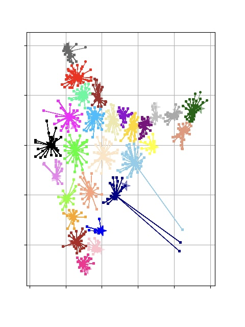
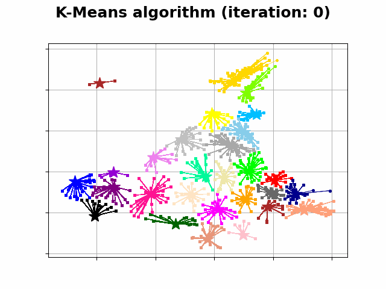

# Facility Location using Fairness in clustering

## Description of codebase

	1. data folder
		1. Contains the final CSV file with combined extracted data of districts (districtsCompleteData.csv) and the first visualization using K=15 (CLUSTERING_FIGURE_FIRST.png)
        2. results folder 
            1. Contains example animation(gif), output(txt), image(png)
    2. constants.py
       1. Contains code to calculate haversine distance between 2 geolocations (as a distance measure for kmeans clustering)
	3. dataCollection.py
      	1. get_districts('https://www.censusindia.co.in/districts') is used for extracting information of districts (name, state and population density) from the 2011 census website
        2. getLatLong() is used for extracting the Latitude and Longitude for each district using the API provided by 'http://api.positionstack.com/v1/forward' and finally making a new CSV by combining the information of districts and their location information
        3. get_location_info(district) is a helper function for getLatLong() that makes the API call for the district(passed as an argument)
	4. kmeanspp.py
      	1. NOTE: Ensure that the data is already exists in the postgres database before running this file
      	2. File takes flag input (use -f for number of clusters(K), for ex. - py kmeanspp.py -f 3)
      	3. Primarily uses PyClustering library
      	4. Contains code for
         	1. Retrieve features of the dataset
         	2. Find K initial clusters using Kmeans++ initialisation method (K is file arg provided before running)
         	3. Perform Kmeans on the dataset
         	4. Outputs final centers, final clusters and SSE of the clustering
         	5. Plots all points and also shows their membership
         	6. Creates a gif file displaying each iteration of Kmeans
	5. bashInput.sh
      	1. Used to pass multiple different values for number of clusters
      	2. Add all values, separated by space in facilities variable

---

## Example: Output for No. of Facilities, K = 28
 
#### Console output
The console output file is present [here](/Data/results/28-output.txt)

#### Plot

#### Animation

---
