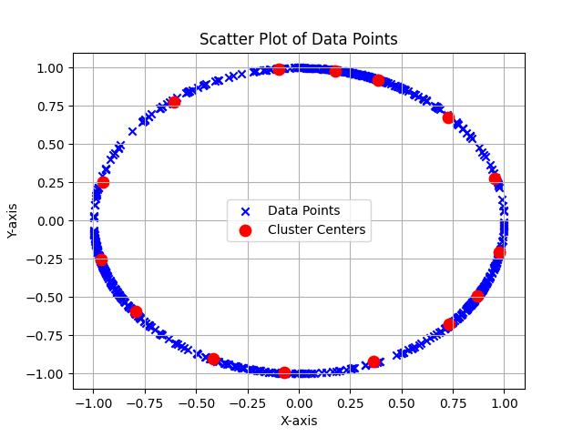

# Variational Fair Clustering - Ziko et.al
This is the code for the AAAI 2021 paper: **[Variational Fair Clustering](https://arxiv.org/abs/1906.08207)**. This clustering method helps you to find clusters with specified proportions of different demographic groups pertaining to a sensitive attribute of the dataset (e.g. race, gender etc.), for any well-known clustering method such as K-means, K-median or Spectral clustering (Normalized cut) etc. in a flexible and scalable way.

---

## Description of codebase

	1. data folder
		1. Contains the data to be clustered in .data format
		2. NOTE: in case, dataset is modified, remember to delete the cache files and other automatically created files in this folder
    2. src folder
		1. bound_update.py
			1. Contains code to update 'a' and 'b', the inner-most loop
			2. No parameters present hence no tinkering required
		2. dataset_load.py
			1. Contains parameters 'K', 'sens_attributes' and 'protected_groups'
			2. TO DO: Add code to input each point multiple times (as many as its pop_density is)
	    3. fair_clustering.py
			1. Contains code of the proposed algorithm
			2. Additionally also makes use of multi-threading
		4. progressBar.py
			1. Ignore, unchanged since inception
		5. utils.py
			1. Contains code for normalization
			2. Also contains variables shared by different threads (SHARED_VARS)
	3. data_visualization.py
		1. Contains code for plotting the final clusters and complete dataset
	4. evaluate_Fair_clustering.sh
		1. Contains options for the running the code
		2. NOTE: Do not run this file despite authors' README saying so, run test_fair_clustering.py instead
	5. test_fair_clustering.py
		1. Driver code which calls all other files as and when needed
		2. Run this file to start the code (after making necessary changes to the dataset)
		3. NOTE: If dataset is modified, remember to delete the cache files and other created files in data folder

---

## Paper details

### Nomenclature, Conventions and Math

1. X → set of points
2. N → no. of points
3. M → dimension of a point
4. K → no. of clusters
5. *C → set of cluster centers
6. S → vector of cluster assignments
    1. $s_i$ → boolean vector of cluster $i$ (size N)
7. J → no. of demographic groups
8. V → vector of demographic assignments
    1. $v_i$ → boolean vector of demographic $i$ (size N)
9. U → float vector of required demographic proportions (size J)
    1. $[\mu_1, \mu_2\ldots, \mu_j] \text{ s.t. } 0 \leq \mu_i \leq 1$   and $\sum \mu_i = 1$
10. $\small D_{KL}(x||y)$ → Kullback-Leibler divergence between distributions $x$ and $y$
    1. Measure to find the distance (and difference) between 2 random variables (probability distributions)
    2. Refer [this video](https://youtu.be/SxGYPqCgJWM?si=D272htbrjbOo3VlZ) for further explanation
11.  $P_k$ → marginal probability of demographics within cluster $k$, i.e. $P(j|k)$
12.  t → transpose operator
13.  $\lambda$ → trade-off controller (between fairness and clustering objective)
14.  *L → Lipschitz value in bound update
15.  $\small F(S)$ → Clustering objective function
16.  Auxiliary function → Function that provides a tight upper bound (i.e. bound with possibility of equality)
17.  $\small A_i(S)$ → Auxiliary function at $i^{th}$ iteration
18.  $a_p^i$ → float vector containing distanc$e^2$  of a point $p$ to all cluster centers (at $i^{th}$ iteration)
    1. $a_{p,k}^i = (x_p - c_k^i)^2$ for kmeans
19.  $b^i$ → N x K integer matrix at $i^{th}$ iteration which enforces balance constraints
    1. $\small b_{p,k}^i = \frac{1}{L}\displaystyle\sum_j(\frac{\mu_j}{1^t S_k^i} - \frac{\mu_j V_{j,p}}{V_j^t S_k^i})$
20. $\epsilon$ or E → Objective function
    1. consists of clustering objective (F) plus fairness penalty
    2. Also called Cluster energy (E)
    3. $\small \epsilon = \text{min}[F(S) + \lambda \displaystyle\sum_k \displaystyle\sum_j -\mu_j \text{ log }P(j|k) ]$
21. $\small G_i(S)$ → Auxiliary function for bound on Fairness Penalty
    1. proportional to $\small \displaystyle \sum_{p=1}^N s_p^t(b_p^i + \text{ log } s_p - \text{ log } s_p^i)$
22. $\small H_i(S)$ → Auxiliary function for bound on Clustering objective
    1. $\small = \displaystyle\sum_{p=1}^N s_p^ta_p^i$
23. $\small A_i(S)$ = $\small \displaystyle \sum_{p=1}^N s_p^t(a_p^i + \lambda b_p^i + \text{ log } s_p - \text{ log } s_p^i)$
24. Now minimize $\small A_i(S)$ as it is an LPP (using Kuhn-Tucker)
25. Updating S after each round
    1. $s_p^{i+1} = \frac{s_p^i e^{-(a_p^i + \lambda b_p^i)}}{1^t[ s_p^i e^{-(a_p^i + \lambda b_p^i]}}$

### Algorithm details

1. Inner iteration
    1. Keeps updating $s_p^{i+1}$ until $A(S)$ doesn’t change
    2. $a_p^i$ fixed from outer loop
    3. Time complexity of each iteration O(N K J)
2. Outer iteration
    1. Recomputes $a_p^i$ from updated $s_p^{i+1}$
    2. Time complexity of each iteration O(N K M)
3. As updates are independent, they are parallelised

---
## Author's README

## Requirements
1. The code is tested on python 3.6. Install the requirements listed in ([requirements.txt](./requirements.txt)) using pip or conda.
2. Download the datasets other than the synthetics from the respective links given in the paper and put in the respective [data/[dataset]](./data) directory.

## Usage
To evaluate the code simply run the following script:
```
sh evaluate_Fair_clustering.sh
```
Change the options inside the scripts accordingly. The options are fairly described in the ([test_fair_clustering.py](./test_fair_clustering.py)).  Note that, the weight of the fairness term (--lmbda) can be much higher (even more than 100) to impose fairness. --lmbda works as a trade-off between the clustering objective and fairness as discussed in the paper.

## Example

For _Synthetic_ dataset with two equal demographic groups (50/50) and _Synthetic-unequal_ dataset with uneven proportions (75/25), we can impose the required proportions according to the dataset while clustering by increasing the weight of the fairness term (--lmbda). With a suitable lambda we can get the required given proportions in each cluster.

<div align="center"></div>
